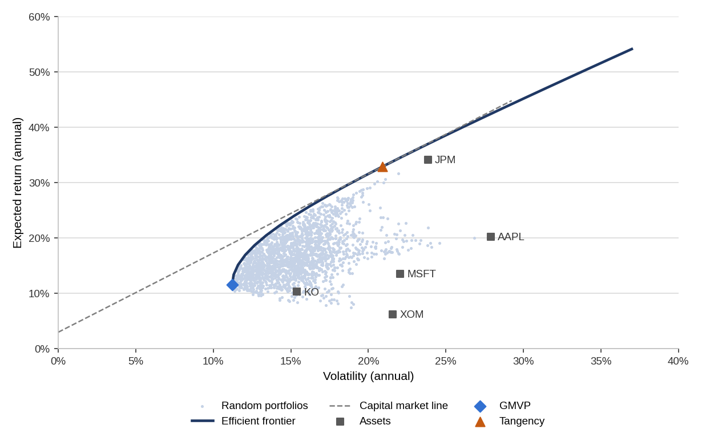

# Markowitz Portfolio Optimizer

Mean-variance portfolio optimization in Excel and VBA. The workbook takes daily prices for a set of stocks, estimates expected returns and the covariance matrix, and finds the global minimum variance portfolio (GMVP), the tangency portfolio and the efficient frontier. The frontier is solved in closed form with a matrix inverse written in VBA, so Solver is not needed.

I built it as the final project for JEM128 Financial Modeling Using MS Excel, VBA at IES, Charles University (2025/26). The course asked each student to come up with their own project, and the Markowitz optimizer was the idea I came up with.

## Sample data and results

The workbook ships with daily closing prices for AAPL, JPM, KO, MSFT and XOM from December 2023 to December 2025 (Stooq, adjusted for splits and dividends). With a 3% risk-free rate:

| Portfolio | Return | Volatility | Sharpe ratio |
|---|---:|---:|---:|
| Global minimum variance | 11.6% | 11.2% | 0.77 |
| Tangency | 32.9% | 20.9% | 1.43 |

The tangency portfolio holds 84% JPM and is short XOM (-30%) and MSFT (-6%). Unconstrained mean-variance weights react strongly to the estimated returns, and two years of history is a short sample, so these are in-sample figures, not a forecast.

## How to run

1. Download `Markowitz_Portfolio_Optimizer.xlsm`, open it in Excel and enable macros. Windows blocks macros in files downloaded from the internet; if the macro bar does not appear, right-click the file, choose Properties and tick Unblock.
2. Click **Open Optimizer** on the Cover sheet.
3. Enter the risk-free rate (in %), periods per year (252 for daily data), the number of frontier points and random portfolios, then click **Calculate**.

To use your own data, click **Import CSV** and select one file per ticker with Date and Close columns (the format Stooq exports). The import uses `Scripting.Dictionary`, so it needs Excel for Windows.

## Workbook

| Sheet | Contents |
|---|---|
| Cover | Description, contents and model checks |
| Data | Daily prices, one column per ticker |
| Optimizer | Inputs, GMVP and tangency results, weights, frontier points and chart |
| Method | Formulas, assumptions and module overview |

## Method

Daily log returns are annualized with 252 trading days. With the covariance matrix Σ, expected returns μ and a vector of ones, the frontier scalars are A = 1'Σ⁻¹1, B = 1'Σ⁻¹μ, C = μ'Σ⁻¹μ and D = AC - B². The GMVP weights are Σ⁻¹1 / A, the tangency weights are Σ⁻¹(μ - r_f) scaled to sum to one, and each frontier point is w = g + h·m for a target return m. Short selling is allowed on the frontier. A Monte Carlo simulation draws 2,000 random long-only portfolios (uniform over the simplex) to show the feasible region.

## Code

The VBA modules are exported to [`src/`](src) so they can be read here. The workbook itself is the working version.

| Module | Purpose |
|---|---|
| `modMatrix` | Matrix multiplication, transpose, Gauss-Jordan inverse with partial pivoting |
| `modPortfolio` | Returns, mean vector, covariance matrix, frontier scalars, portfolio weights and statistics |
| `modSimulation` | Random long-only portfolios |
| `modAnalysis` | Runs the optimization and writes the Optimizer sheet |
| `modChart` | Builds the frontier chart |
| `modDataImport` | CSV import, Stooq download, example data generator |
| `frmOptimizer` | Input form (code only, the form layout is in the workbook) |
| `modTest` | Three-asset test case for the engine |

Matúš Balko, 2026
